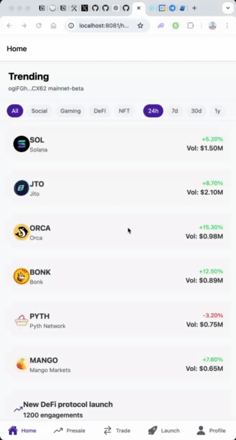

# SocialFi Mobile App

A proof-of-concept (POC) mobile application built with React Native and Expo, demonstrating a social-focused DeFi platform on Solana. While the core functionality is implemented, the UI/UX requires further refinement and polishing for production use.

## Visual Documentation

### App Flow

<p align="center">
  
</p>

> Demo of the main app functionality including wallet connection, token trading, and presale management.

## Overview

SocialFi combines social networking features with decentralized finance capabilities, allowing users to:

- Launch personal tokens
- Trade tokens through DEX integration
- Participate in presales
- Build social capital through engagement
- Track trending tokens and social metrics

## Technical Stack

- **Framework**: React Native with Expo
- **Styling**: NativeWind (TailwindCSS for React Native) with custom theme and refined component design
- **Navigation**: Expo Router
- **State Management**: Zustand
- **Blockchain**: Solana Web3.js
- **DEX Integration**: Jupiter SDK
- **Authentication**: Solana Mobile Wallet Adapter

## Design Features

- Consistent dark/light theme support
- Custom animated components
- Polished UI transitions
- Responsive layouts
- Native platform design considerations

## Key Features

### Token Trading

- Token swap interface
- Price charts and trading signals
- Jupiter DEX integration (mocked)
- Token selection with search functionality

### Token Launch Platform

- Custom token creation
- Bonding curve configuration
- Initial liquidity settings
- Token distribution parameters

### Presale Management

- Configurable presale parameters
- Dynamic vesting schedule visualization
- Whitelist management
- Progress tracking

### Social Features

- Social score calculation
- Activity feed
- Follow/unfollow functionality
- Profile management

## Mocked Functionality

Currently, the following features are mocked for demonstration:

- Blockchain transactions
- Token balances and prices
- User profiles and social interactions
- Trading history and signals
- DEX liquidity data

## Development Setup

1. Install dependencies:

   ```bash
   npm install
   ```

2. Start the development server:

   ```bash
   npx expo start
   ```

3. Run on platform:

- iOS: Press 'i' in terminal
- Android: Press 'a' in terminal
- Web: Press 'w' in terminal

## Project Structure

```
app/
├── (tabs)/           # Main tab screens
├── components/       # Reusable components
├── providers/        # Context providers
├── stores/          # Zustand stores
├── utils/           # Helper functions
└── screens/         # Additional screens
```

## Future Improvements

- Real Solana blockchain integration
- Jupiter DEX API implementation
- Social graph implementation
- Token analytics integration
- Enhanced security features
- Performance optimizations

## Contributing

This is a proof-of-concept project. Feel free to fork and extend the functionality.

## License

MIT
